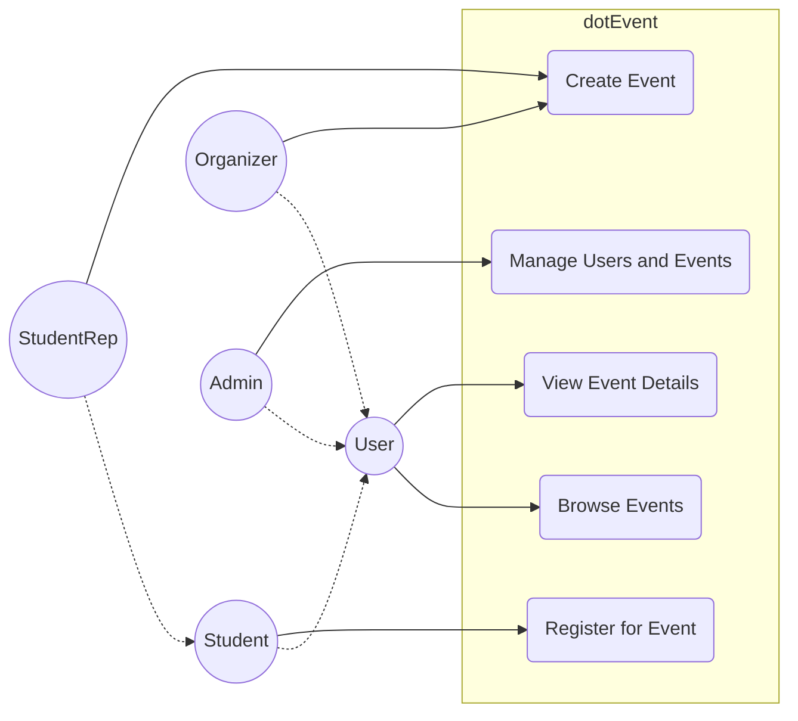
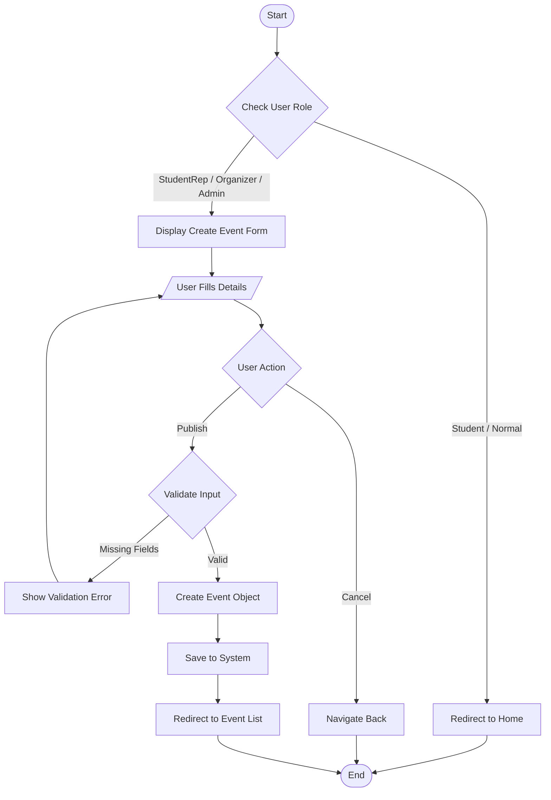
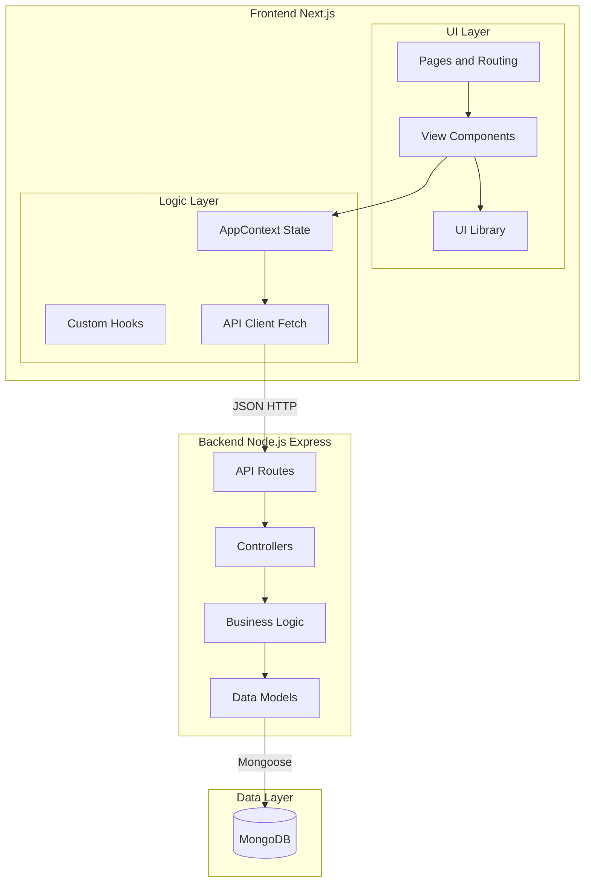
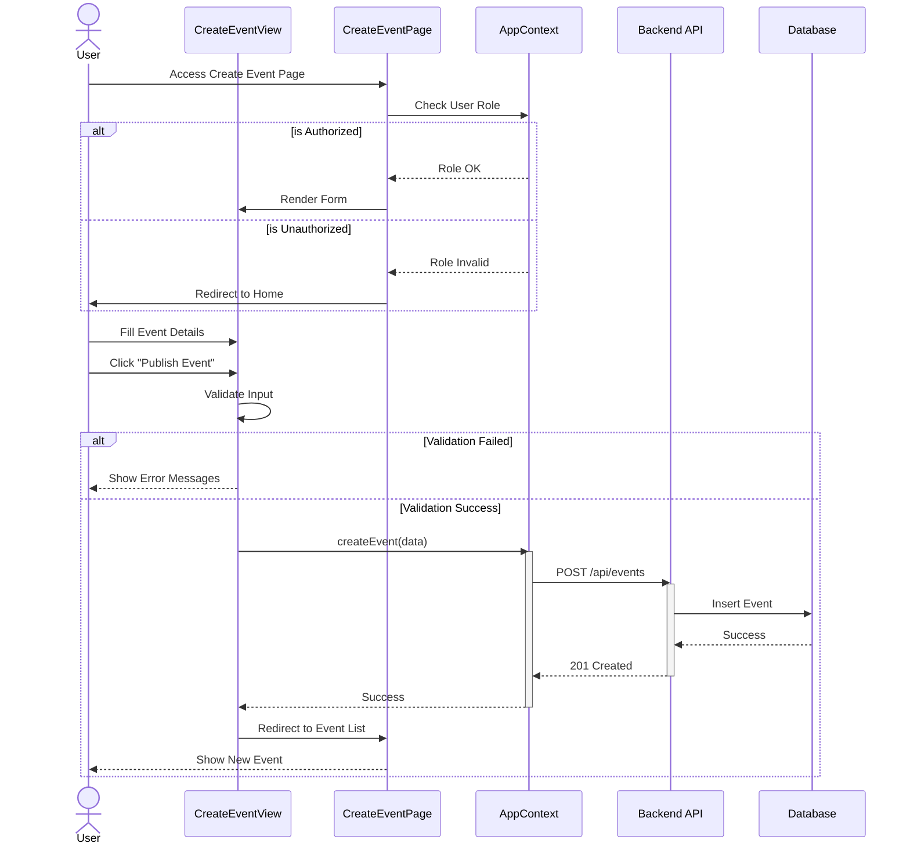
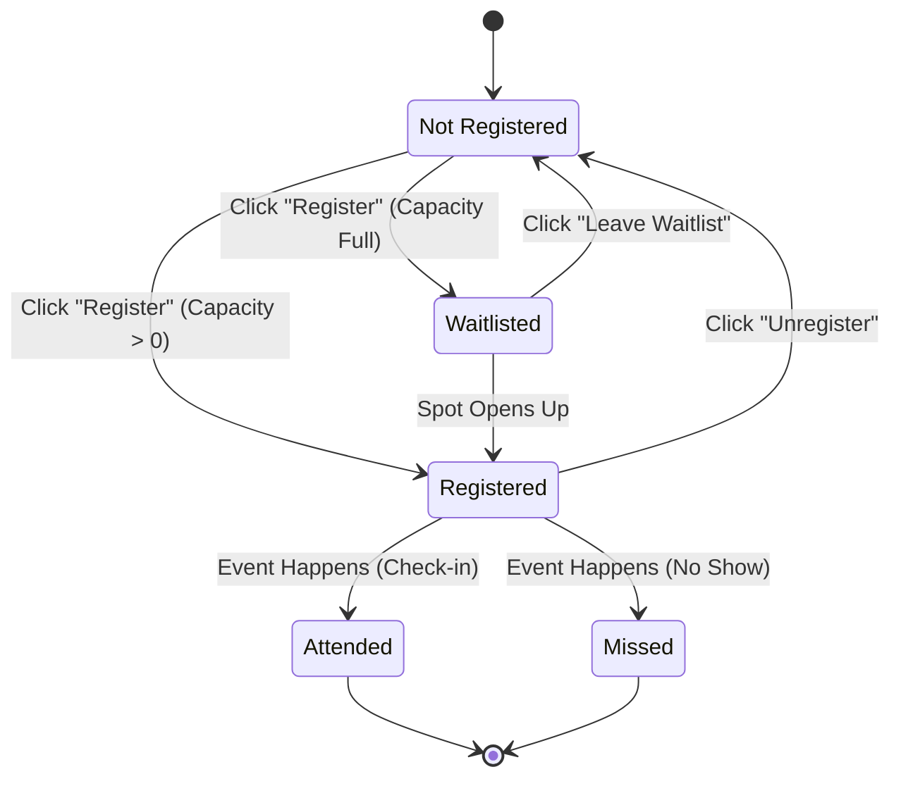
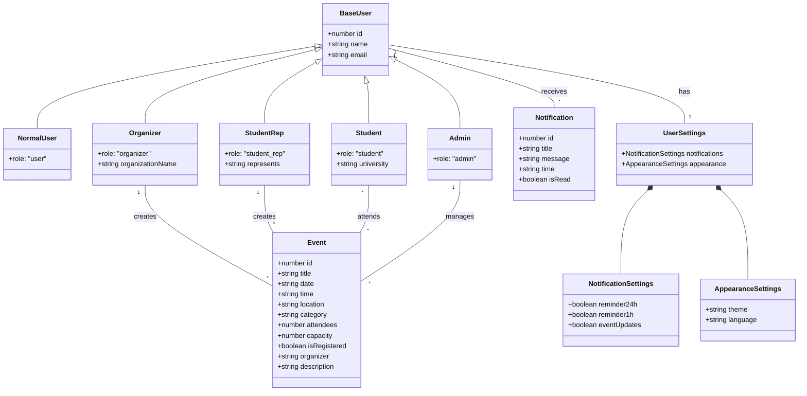

# dotEvent System Architecture

## 1. Use Case Diagram

```mermaid
graph LR
   %% Actors
   U((User))
   S((Student))
   SR((StudentRep))
   O((Organizer))
   A((Admin))
  
   %% Relationships
   S -.-> U
   SR -.-> S
   O -.-> U
   A -.-> U
  
   %% Boundaries
   subgraph dotEvent [dotEvent]
       direction TB
       UC1(Browse Events)
       UC2(View Event Details)
       UC3(Register for Event)
       UC4(Create Event)
       UC5(Manage Users and Events)
   end
  
   %% Connections
   U --> UC1
   U --> UC2
   S --> UC3
   SR --> UC4
   O --> UC4
   A --> UC5
```

## 2. Activity Diagram

```mermaid
graph TD
   %% Nodes
   Start([Start])
   CheckRole{Check User Role}
   Redirect[Redirect to Home]
   ShowForm[Display Create Event Form]
   UserInput[/User Fills Details/]
   Action{User Action}
   GoBack[Navigate Back]
   Validate{Validate Input}
   ShowError[Show Validation Error]
   Create[Create Event Object]
   Save[Save to System]
   RedirectList[Redirect to Event List]
   Stop([End])


   %% Flow
   Start --> CheckRole
  
   CheckRole -- "Student / Normal" --> Redirect
   Redirect --> Stop
  
   CheckRole -- "StudentRep / Organizer / Admin" --> ShowForm
   ShowForm --> UserInput
  
   UserInput --> Action
  
   Action -- "Cancel" --> GoBack
   GoBack --> Stop
  
   Action -- "Publish" --> Validate
  
   Validate -- "Missing Fields" --> ShowError
   ShowError --> UserInput
  
   Validate -- "Valid" --> Create
   Create --> Save
   Save --> RedirectList
   RedirectList --> Stop
```

## 3. Component Diagram

```mermaid
graph TD
   %% Client Side
   subgraph Client_Frontend [Frontend Next.js]
       direction TB
      
       subgraph UI_Layer [UI Layer]
           Pages[Pages and Routing]
           Views[View Components]
           UI_Lib[UI Library]
       end
      
       subgraph Logic_Layer [Logic Layer]
           Context[AppContext State]
           Hooks[Custom Hooks]
           API_Client[API Client Fetch]
       end
      
       Pages --> Views
       Views --> UI_Lib
       Views --> Context
       Context --> API_Client
   end


   %% Server Side
   subgraph Server_Backend [Backend Node.js Express]
       direction TB
      
       API_Gateway[API Routes]
       Controllers[Controllers]
       Services[Business Logic]
       Models[Data Models]
      
       API_Gateway --> Controllers
       Controllers --> Services
       Services --> Models
   end


   %% Database
   subgraph Data [Data Layer]
       DB[(MongoDB)]
   end


   %% Interactions
   API_Client -- "JSON HTTP" --> API_Gateway
   Models -- "Mongoose" --> DB
```

## 4. Sequence Diagram

```mermaid
sequenceDiagram
   actor User
   participant View as CreateEventView
   participant Page as CreateEventPage
   participant Context as AppContext
   participant API as Backend API
   participant DB as Database


   User->>Page: Access Create Event Page
   Page->>Context: Check User Role
  
   alt is Authorized
       Context-->>Page: Role OK
       Page->>View: Render Form
   else is Unauthorized
       Context-->>Page: Role Invalid
       Page->>User: Redirect to Home
   end


   User->>View: Fill Event Details
   User->>View: Click "Publish Event"
  
   View->>View: Validate Input
  
   alt Validation Failed
       View-->>User: Show Error Messages
   else Validation Success
       View->>Context: createEvent(data)
       activate Context
      
       Context->>API: POST /api/events
       activate API
       API->>DB: Insert Event
       DB-->>API: Success
       API-->>Context: 201 Created
       deactivate API
      
       Context-->>View: Success
       deactivate Context
      
       View->>Page: Redirect to Event List
       Page-->>User: Show New Event
   end
```

## 5. State Diagram

```mermaid
stateDiagram
   [*] --> NotRegistered
  
   state "Not Registered" as NotRegistered
   state "Registered" as Registered
   state "Waitlisted" as Waitlisted
   state "Attended" as Attended
   state "Missed" as Missed
  
   NotRegistered --> Registered: Click "Register" (Capacity > 0)
   NotRegistered --> Waitlisted: Click "Register" (Capacity Full)
  
   Registered --> NotRegistered: Click "Unregister"
   Waitlisted --> NotRegistered: Click "Leave Waitlist"
  
   Waitlisted --> Registered: Spot Opens Up
  
   Registered --> Attended: Event Happens (Check-in)
   Registered --> Missed: Event Happens (No Show)
  
   Attended --> [*]
   Missed --> [*]
```

## 6. Class Diagram

```mermaid
classDiagram
   %% User Hierarchy
   class BaseUser {
       +number id
       +string name
       +string email
   }
  
   class NormalUser {
       +role: "user"
   }
  
   class Student {
       +role: "student"
       +string university
   }
  
   class StudentRep {
       +role: "student_rep"
       +string represents
   }
  
   class Organizer {
       +role: "organizer"
       +string organizationName
   }
  
   class Admin {
       +role: "admin"
   }
  
   BaseUser <|-- NormalUser
   BaseUser <|-- Student
   BaseUser <|-- StudentRep
   BaseUser <|-- Organizer
   BaseUser <|-- Admin


   %% Core Domain Objects
   class Event {
       +number id
       +string title
       +string date
       +string time
       +string location
       +string category
       +number attendees
       +number capacity
       +boolean isRegistered
       +string organizer
       +string description
   }


   class Notification {
       +number id
       +string title
       +string message
       +string time
       +boolean isRead
   }


   %% Settings
   class UserSettings {
       +NotificationSettings notifications
       +AppearanceSettings appearance
   }
  
   class NotificationSettings {
       +boolean reminder24h
       +boolean reminder1h
       +boolean eventUpdates
   }
  
   class AppearanceSettings {
       +string theme
       +string language
   }


   %% Relationships
   UserSettings *-- NotificationSettings
   UserSettings *-- AppearanceSettings
  
   BaseUser "1" -- "1" UserSettings : has
   BaseUser "1" -- "*" Notification : receives
   Organizer "1" -- "*" Event : creates
   StudentRep "1" -- "*" Event : creates
   Student "*" -- "*" Event : attends
   Admin "1" -- "*" Event : manages
```
